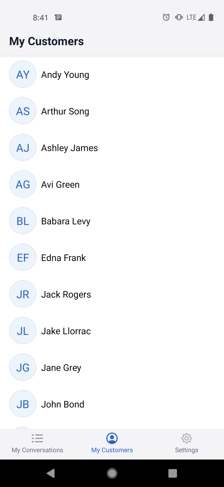
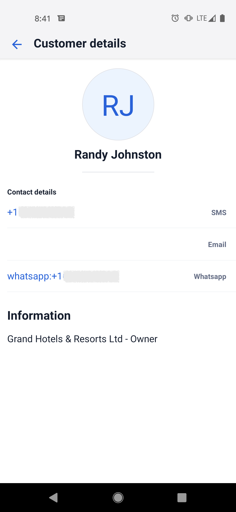
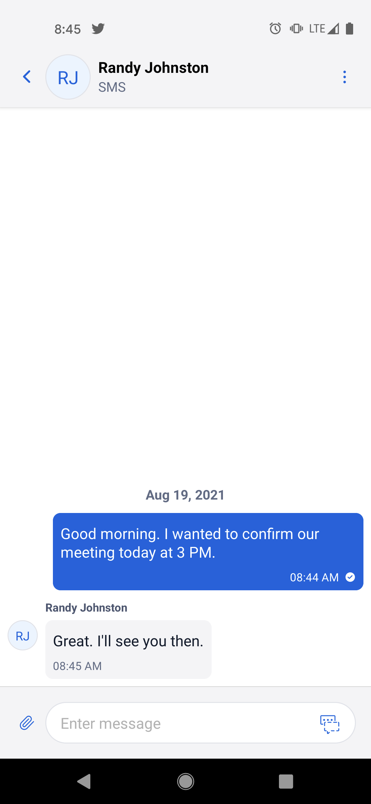
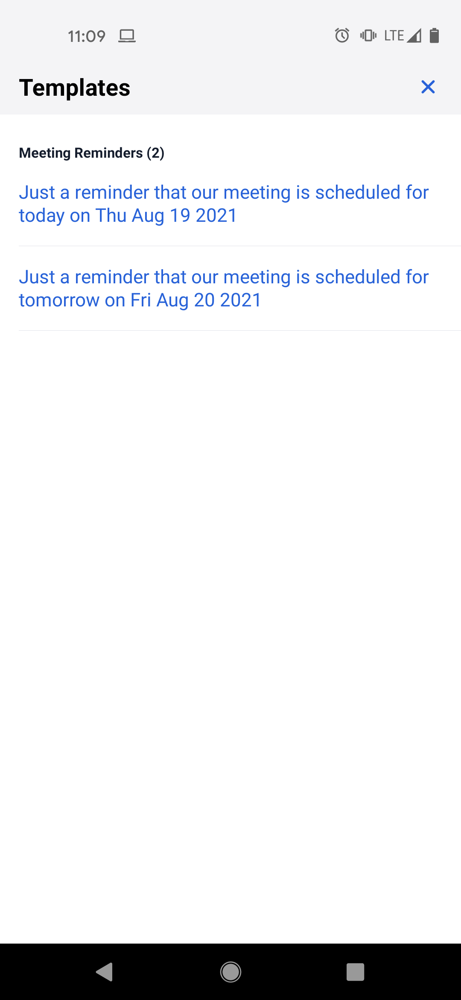
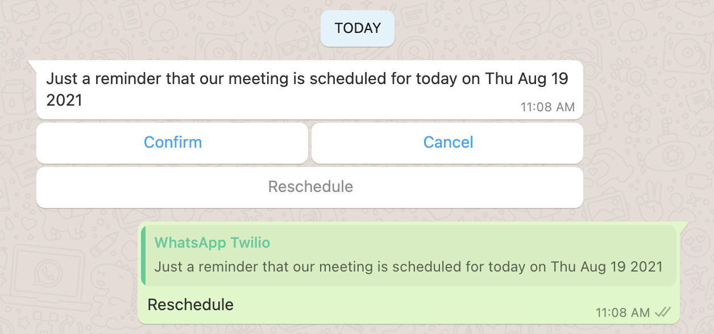
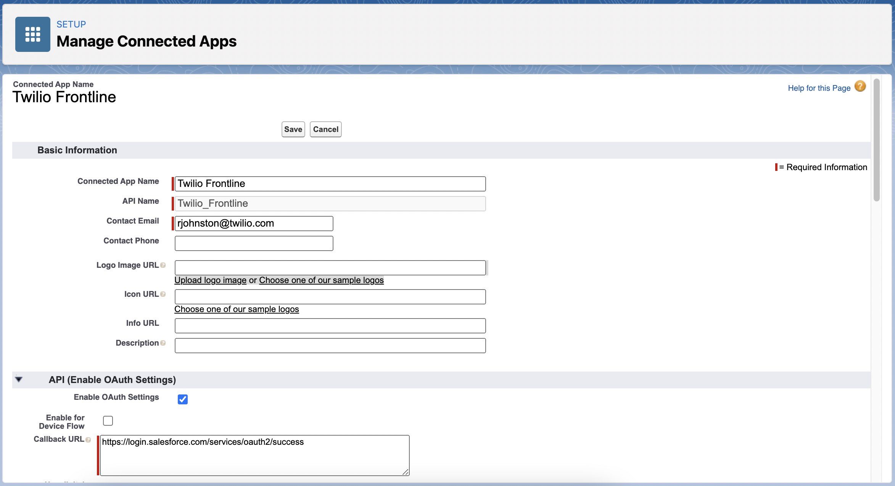
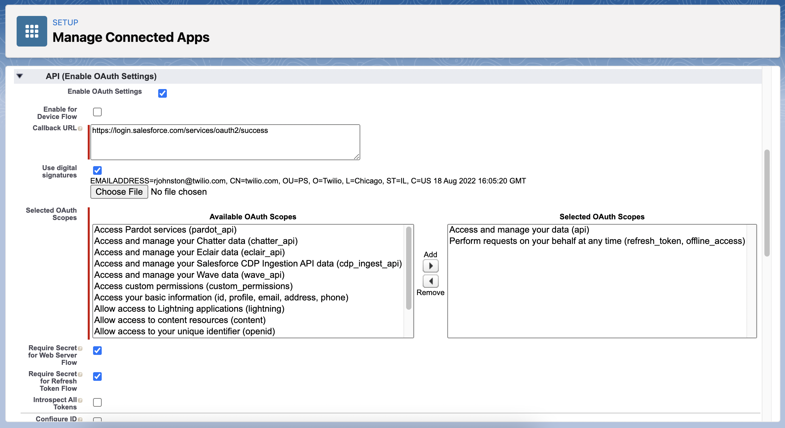

# Twilio Frontline Salesforce CRM Integration

This Twilio Functions service implements the Frontline callbacks and Conversations callbacks to faciliate inbound and outbound SMS and WhatsApp support for [Twilio Frontline](https://www.twilio.com/docs/frontline) based on Contact ownership in Salesforce. 

## How it works

The Functions implement the following Frontline and Conversations callbacks:

#### Frontline
- [crm.js](functions/crm.js) - Implements the Frontline [CRM Callback](https://www.twilio.com/docs/frontline/my-customers) to:
    - Pull a Customer List per user from Contact records from Salesforce based on the Salesforce Contact Owner matching the Frontline user's identity
    - Pull a Customer's details by Customer ID (Salesforce Contact Record ID)
- [outgoing-conversation.js](functions/outgoing-conversation.js) - Implements the Frontline [Outgoing Conversations Callback](https://www.twilio.com/docs/frontline/outgoing-conversations) to return the outbound proxy addresses for SMS and WhatsApp channels
- [templates.js](functions/templates.js) - Implements the Frontline [Templates Callback](https://www.twilio.com/docs/frontline/templated-messages) to return WhatsApp-approved templates for outbound WhatsApp conversations

#### Conversations 
- [inbound-conversation.protected.js](functions/inbound-conversation.protected.js) - Implements the Frontline [Custom Routing Callback](https://www.twilio.com/docs/frontline/handle-incoming-conversations#custom-routing-callback-request-parameters):
    - Handles [onConversationAdd](https://www.twilio.com/docs/conversations/conversations-webhooks#onconversationadd) webhook from Conversations to set the conversation friendly name to the  Contact name from Salesforce
    - Handles [onParticipantAdded](https://www.twilio.com/docs/conversations/conversations-webhooks#onparticipantadded) webhook from Conversations to update the customer participant's `customer_id` and `display_name`

## Screenshots
 
The following screenshots show the Frontline worker screens for SMS as well as Frontline worker WhatsApp template selection and customer receipt of the WhatsApp template:

#### Customer List and Details
 

#### Outbound SMS Conversation


#### Outbound WhatsApp Templates
 

## Pre-requisites

To deploy these Frontline Functions, you will need:

- An active Twilio account with Frontline and [approved WhatsApp Senders and Templates](https://www.twilio.com/docs/whatsapp/tutorial/connect-number-business-profile) 
- [SSO](https://www.twilio.com/docs/frontline/sso) configured for your Frontline instance. This ensures that the Salesforce and Frontline accounts can be linked securely using a common SSO identity provider.
- npm version 5.0.0 or later installed (type `npm -v` in your terminal to check)
- Node.js version 12 or later installed (type `node -v` in your terminal to check)
- [Twilio CLI](https://www.twilio.com/docs/twilio-cli/quickstart#install-twilio-cli) along with the [Serverless Plugin](https://www.twilio.com/docs/twilio-cli/plugins#available-plugins). Run the following commands to install them:
  ```bash
  # Install the Twilio CLI
  npm install twilio-cli -g
  # Install the Serverless Plugin
  twilio plugins:install @twilio-labs/plugin-serverless
  ```
- [Salesforce Developer](https://developer.salesforce.com/signup) or Sandbox Org. with System Administrator access

## Salesforce Connected App

Create a [Salesforce Connected App](https://help.salesforce.com/articleView?id=sf.connected_app_create_basics.htm) under Salesforce Setup > App Manager > New Connected App with at least `Access and manage your data (api)` and `Perform requests on your behalf at any time (refresh_token, offline_access)` OAuth scopes. The Callback URL can be `https://login.salesforce.com/services/oauth2/success` and is only used during the initial setup.



Select "Use digital signatures" and follow Salesforce's instructions to [Create a Private Key and Self-Signed Digital Certificate](https://developer.salesforce.com/docs/atlas.en-us.sfdx_dev.meta/sfdx_dev/sfdx_dev_auth_key_and_cert.htm)
- Upload the resulting `server.crt` file to Salesforce by selecting "Choose File" next to "Use digital signatures"
- Place your private key `server.key` in a cloned version of this respository at the path `assets/server.private.key`
- [Authorize your Salesforce Org. Using the JWT Bearer Flow](https://developer.salesforce.com/docs/atlas.en-us.sfdx_dev.meta/sfdx_dev/sfdx_dev_auth_jwt_flow.htm)



## Functions Setup

1. Clone this repo:

  ```bash
  git clone https://github.com/randyjohnston/function-frontline-salesforce
  ```

2. Install the dependencies
  
  ```
  # Install the dependencies of the Twilio Functions
  npm install
  ```

3. Copy the `.env.example` file

  ```bash
  cp .env.example .env
  ```

4. Edit `.env`:

  ```bash
    ACCOUNT_SID=Found at https://www.twilio.com/console
    AUTH_TOKEN=Found at https://www.twilio.com/console 
    SF_CONSUMER_KEY=Your Salesforce Connected App OAuth Client ID
    SF_USERNAME=The username to make JWT bearer token Salesforce API calls
    SSO_REALM_SID=Obtain from the Twilio Console under Frontline > Manage > SSO/Log in 
    WHATSAPP_NUMBER=WhatsApp number for outbound conversations proxy address
    SMS_NUMBER=SMS number for outbound conversations proxy address
    DEFAULT_WORKER=The default Frontline worker for inbound conversation routing if no matching Contact Owner is found in Salesforce
  ```

## Development

In order to develop locally, you can use the `twilio-run` CLI by running (from the root directory):

  ```
  # Start Twilio Functions
  npm run start 
  ```

This will automatically start up the Twilio Serverless local development server. Your app will run on `http://localhost:3000`.

## Deploy

When you are ready, deploy your Twilio Functions:

```bash
twilio serverless:deploy
```
